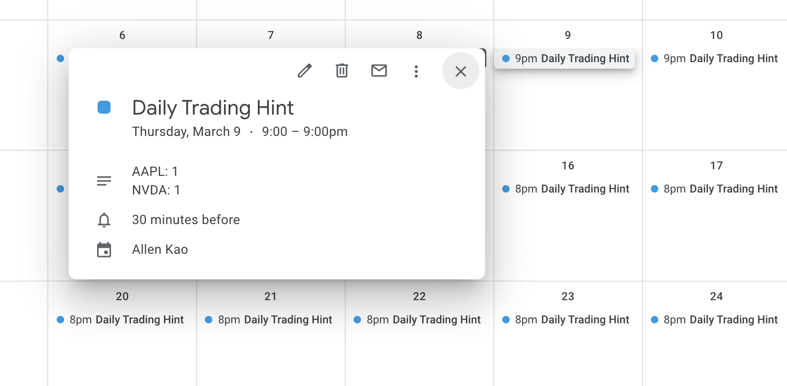

# Alice

A tool to add google calendar events with some customized period, like regular quota strategy.

For example if you want to buy VOO 100 shares from 2023/01/01 to 2023/04/01 evenly, 
you have to buy 1 or 2 shares during these trading days.

This tool will calculate in which days you have to buy which stock how many shares by the given condition.

## Config

Update [config.yaml](config/config.yaml) to set your investment schema.
- Target: The stock name you would like to buy.
- From: The date start to buy the stock.
- To: The date finish to buy the stock.
- Shares: Share amount of the target

## Usage

1. Enable google calendar API.
2. Get credentials from your google account.
3. Rename the credential json file to `credentials.json` then move to the root path of the project.
4. Execute the program: ```python main.py```

[Google api reference guide](https://developers.google.com/calendar/api/quickstart/python)

## Result



## Setup Virtual Environment

cd to the root of the project

### 1. Create Virtual Environment

```
$ python3 -m venv venv
```

### 2. Active Into The Virtual Environment

```
$ source venv/bin/activate
```

### 3. Install All The Dependencies

```
$ pip3 install -r requirements.txt 
```
